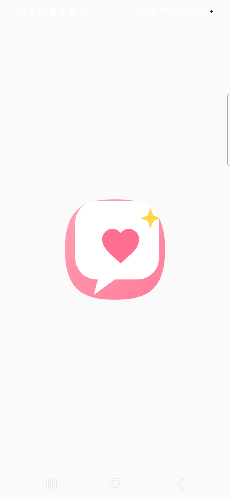
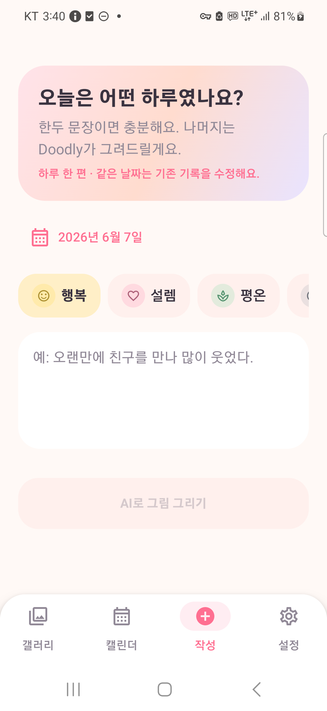
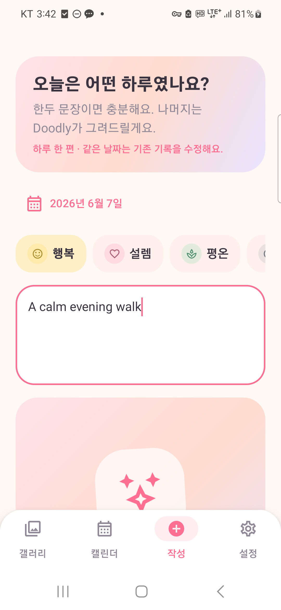
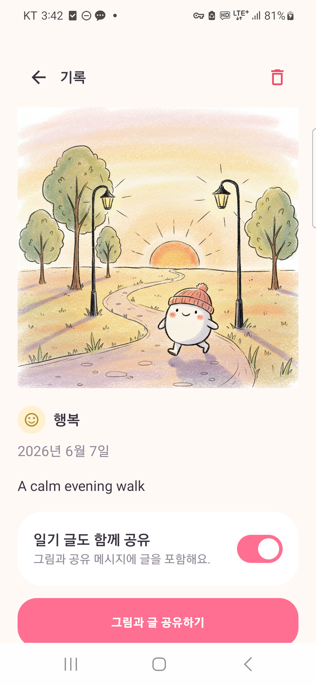
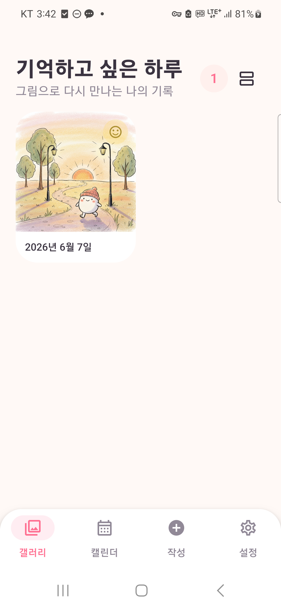
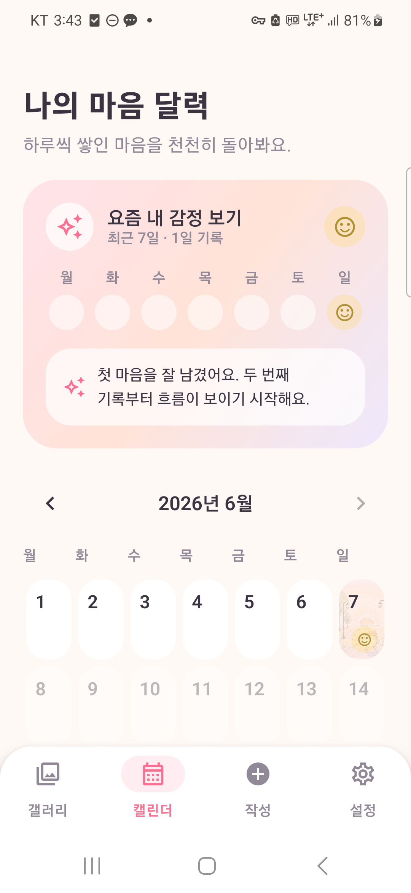
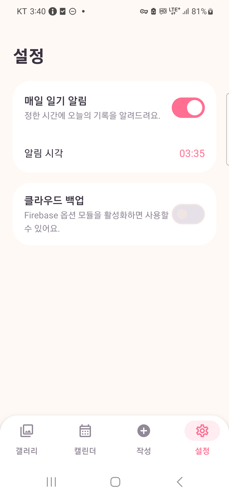

# Doodly

> 짧은 하루를 AI 그림으로 남기는 비주얼 다이어리

[](https://developer.android.com/)
[](https://kotlinlang.org/)
[](https://developer.android.com/compose)

## 앱 소개

**Doodly**는 한두 문장의 짧은 일기와 오늘의 감정을 입력하면 AI가 따뜻한 손그림 스타일의 이미지로 바꿔 주는 Android 비주얼 다이어리입니다.

긴 글을 쓰는 부담은 줄이고, 하루의 기억을 다시 보고 싶은 그림으로 남기는 것을 목표로 기획했습니다. 날짜마다 한 편의 기록을 저장하며, 갤러리와 감정 캘린더를 통해 기록과 감정 변화를 돌아볼 수 있습니다.

## 주요 기능

### 1. 짧은 일기와 감정 기록

- 날짜, 감정, 한두 문장의 일기를 입력합니다.
- 같은 날짜를 다시 선택하면 기존 기록을 불러와 수정합니다.
- 미래 날짜에는 기록을 작성할 수 없습니다.

### 2. AI 일러스트 생성

- Gemini가 일기와 감정을 이미지 생성용 프롬프트로 변환합니다.
- Gemini 이미지 모델이 손그림 스타일 이미지를 생성합니다.
- 생성 중 애니메이션을 표시하고 완료 시 이미지가 부드럽게 등장합니다.
- API 키가 없거나 요청이 실패하면 감정 색상의 로컬 이미지를 생성해 앱 흐름을 유지합니다.

### 3. 갤러리와 상세 기록

- Room의 `Flow`를 구독해 저장된 기록을 자동으로 갱신합니다.
- 그리드/리스트 보기 전환을 지원합니다.
- 상세 화면에서 이미지와 일기 내용을 확인하고 삭제할 수 있습니다.

### 4. 감정 캘린더와 AI 한마디

- 날짜별 감정 아이콘과 생성 이미지를 월간 캘린더에 표시합니다.
- 최근 7일의 감정 흐름을 요약하고 AI가 짧은 메시지를 제공합니다.
- 미래 날짜와 미래 달은 선택할 수 없습니다.

### 5. 공유와 알림

- 일기 글 포함 여부를 선택해 이미지 공유 시트를 호출합니다.
- FileProvider로 안전한 임시 이미지 URI를 전달합니다.
- 설정한 시각에 AlarmManager 기반 일기 알림을 표시합니다.
- 알림을 누르면 `doodly://write` 딥링크로 작성 화면을 엽니다.

## 실행 화면

실제 Galaxy S22에서 실행해 캡처한 화면입니다.

<p align="center">
  
  
  
  
</p>

<p align="center">
  
  
  
</p>

## 시연 및 제출 자료

> 아래 영상 URL 두 곳은 제출 전에 실제 업로드한 영상의 공개 링크로 교체해야 합니다.

| 자료 | 링크 |
|---|---|
| 2분 요약 영상 | **(https://youtube.com/shorts/7BKu9byTO4I?si=FEyI5pFiT8EWsz7Y)** |
| 10분 상세 발표 영상 | **[TODO: 10분 상세 발표 YouTube URL 입력]** |
| 프로젝트 최종 보고서 | [PDF 열기](docs/Doodly_Final_Report.pdf) · [편집용 Markdown](docs/FINAL_REPORT.md) |
| APK 다운로드 | [Doodly v1.0 Debug APK](releases/Doodly-v1.0-debug.apk) |

영상 촬영 순서와 발표 대본은 [VIDEO_GUIDE.md](docs/VIDEO_GUIDE.md)에 작성했습니다.

## 시스템 아키텍처

```text
Compose UI
   ↓ collectAsState()
ViewModel
   ↓ suspend / Flow
Repository
   ↓
DAO
   ↓
Room Database (SQLite)

AI: WriteViewModel → AiRepository → Gemini SDK / Retrofit API
공유: DetailScreen → ShareHelper → FileProvider → Android Sharesheet
알림: SettingsViewModel → AlarmManager → BroadcastReceiver → Deep Link
```

수동 의존성 주입과 `ViewModelProvider.Factory`를 사용했습니다. Firebase 백업은 코어 빌드와 분리하기 위해 기본적으로 `NoOpBackupRepository`가 주입됩니다.

## 기술 스택

| 구분 | 기술 |
|---|---|
| Language | Kotlin 2.2.10, Java 17 |
| UI | Jetpack Compose, Material 3 |
| Architecture | MVVM, Repository Pattern, Manual DI |
| Local DB | Room 2.8.4, KSP, Kotlin Flow |
| AI | Gemini SDK 0.9.0, Gemini text/image models |
| Network | Retrofit 2.11.0, OkHttp 4.12.0, Gson |
| Image | Coil Compose 2.7.0 |
| Navigation | Navigation Compose 2.8.9, Deep Link |
| Notification | AlarmManager, NotificationCompat, Accompanist Permissions |
| Share | Android Intent, FileProvider |
| Build | Gradle Kotlin DSL, Version Catalog, Secrets Gradle Plugin |

## 프로젝트 구조

```text
com.doodly.app
├─ data
│  ├─ local          # Room Entity, DAO, Database, TypeConverter
│  ├─ remote         # Gemini SDK, Retrofit API와 DTO
│  └─ repository     # Diary, AI, Settings, Backup Repository
├─ di                # AppContainer 수동 의존성 주입
├─ notification      # 알림 채널, 예약, Receiver
├─ share             # 이미지 워터마크와 FileProvider 공유
└─ ui
   ├─ write          # 일기 작성과 AI 생성
   ├─ gallery        # 그리드/리스트 갤러리
   ├─ calendar       # 월간 감정 캘린더와 AI 감정 요약
   ├─ detail         # 상세, 삭제, 공유
   ├─ settings       # 알림 시간과 백업 설정
   ├─ navigation     # NavHost와 딥링크
   └─ theme          # 컬러, 타이포그래피, 테마
```

## 빌드 및 실행

### 요구 환경

- Android Studio
- JDK 17
- Android SDK 35
- Android 8.0(API 26) 이상 기기 또는 에뮬레이터

### API 키 설정

프로젝트 루트에 Git에서 제외된 `secrets.properties` 파일을 만들고 Gemini API 키를 입력합니다.

```properties
AI_KEY=YOUR_GEMINI_API_KEY
```

키가 없을 때는 `local.defaults.properties`의 기본값을 사용하며, AI 요청 대신 로컬 폴백 이미지가 생성됩니다. API 키는 소스에 하드코딩하지 않고 `BuildConfig.AI_KEY`로만 접근합니다.

### 빌드

Windows:

```powershell
.\gradlew.bat assembleDebug
```

macOS/Linux:

```bash
./gradlew assembleDebug
```

생성 APK:

```text
app/build/outputs/apk/debug/app-debug.apk
```

## 딥링크 테스트

```bash
adb shell am start -a android.intent.action.VIEW -d "doodly://write"
adb shell am start -a android.intent.action.VIEW -d "doodly://diary/1"
```

## Firebase 백업 활성화

기본 빌드는 `NoOpBackupRepository`를 사용하므로 `google-services.json` 없이 실행됩니다. Firebase 백업을 실제로 활성화하려면 다음 작업이 필요합니다.

1. Firebase 프로젝트에서 Firestore와 Storage를 활성화합니다.
2. `app/google-services.json`을 추가합니다.
3. Google Services 플러그인과 Firebase Firestore/Storage 의존성을 추가합니다.
4. `BackupRepository`의 Firebase 구현을 작성하거나 연결합니다.
5. `AppContainer`에서 `NoOpBackupRepository` 대신 Firebase 구현을 주입합니다.

현재 제출 버전에서 Firebase 클라우드 백업은 **선택 기능으로 비활성화**되어 있으며, 로컬 Room 저장은 정상 동작합니다.

## 제출 전 교체 항목

- [ ] README의 2분 요약 영상 TODO를 실제 공개 URL로 교체
- [ ] README의 10분 발표 영상 TODO를 실제 YouTube URL로 교체
- [ ] `docs/FINAL_REPORT.md`의 작성자/학번/과목명 입력
- [ ] 필요하면 PDF 표지의 작성자 정보를 입력한 뒤 PDF 재생성
- [ ] GitHub `main` 브랜치에서 README 이미지와 APK 링크 확인
- [ ] GitHub 저장소에 `secrets.properties`, `local.properties`가 포함되지 않았는지 확인

## 문서

- [프로젝트 최종 보고서](docs/FINAL_REPORT.md)
- [영상 촬영 및 발표 가이드](docs/VIDEO_GUIDE.md)
- [제출 전 체크리스트](docs/SUBMISSION_CHECKLIST.md)

